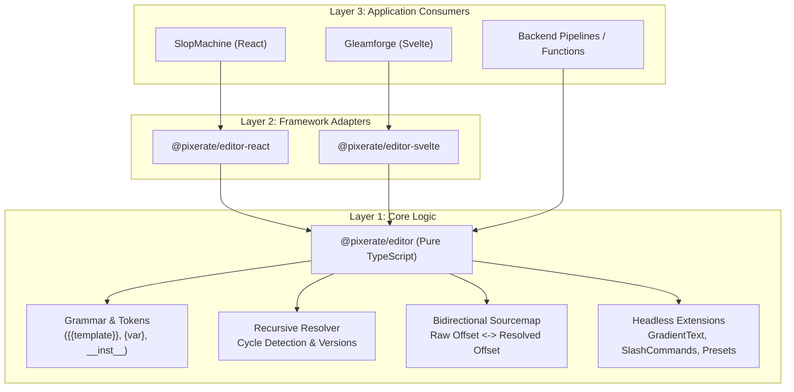

# @pixerate/editor

<p align="center">
  <strong>A high-performance, UI-agnostic media and rich-text editing engine with first-class JavaScript, React, and Svelte packages.</strong>
</p>

<p align="center">
  <a href="https://www.npmjs.com/package/@pixerate/editor"></a>
  <a href="https://www.npmjs.com/package/@pixerate/editor-react"></a>
  <a href="https://www.npmjs.com/package/@pixerate/editor-svelte"></a>
  <a href="https://github.com/Pixerate/editor/actions/workflows/ci.yml"></a>
  <a href="https://github.com/Pixerate/editor/blob/main/LICENSE"></a>
</p>

---

## 🌟 Overview

`@pixerate/editor` is designed from the ground up for modern creative workflows—powering both **prompt-engineering studios** (like [SlopMachine](https://github.com/Pixerate/slopmachine)) and **document-level rich-text editors** (like [Gleamforge](https://github.com/Pixerate/gleamforge)).

### Core Capabilities
- 🚀 **UI-Agnostic Core (`@pixerate/editor`)**: Pure TypeScript token parser, AST tokenizer, recursive template resolution with cycle detection, bidirectional character sourcemapping, and headless TipTap/ProseMirror extensions. Usable in Node.js, Web Workers, Firebase Functions, or custom vanilla DOM frontends.
- ⚛️ **React Bindings (`@pixerate/editor-react`)**: Drop-in `usePromptEditor` hook, `<EditorContent />`, contextual `<BubbleMenu />`, and lightweight read-only `<TemplateRenderer />`.
- 🧡 **Svelte 5 Bindings (`@pixerate/editor-svelte`)**: Native runes-based state management, drop-in `<EditableTextNodeEditor />`, `<BubbleMenu />`, and `<TemplateRenderer />`.
- 🎨 **Dynamic Syntax Styling**: Inline gradient animations for `{{template}}` tags, badges for `{variable}` fields, and italic styling for `__instructions__`.
- ⚡ **Plain Text Invariant**: Guarantees raw string multiline format without leaking HTML artifacts, preserving newline paragraph breaks across clipboard paste and export.
- 🗺️ **Bidirectional Sourcemaps**: Trace character offsets from rendered output directly back to source templates for error reporting and precision highlighting.

---

## 📦 Packages

| Package | Version | Description | Target Consumers |
| :--- | :--- | :--- | :--- |
| [`@pixerate/editor`](./packages/core) | `0.1.0` | Pure TS core, grammar parser, resolvers, extensions | Node.js, Workers, Vanilla JS |
| [`@pixerate/editor-react`](./packages/react) | `0.1.0` | React hooks, TipTap wrappers, AST renderer | SlopMachine, Next.js, Vite React |
| [`@pixerate/editor-svelte`](./packages/svelte) | `0.1.0` | Svelte 5 runes bindings & components | Gleamforge, SvelteKit apps |

---

## 🏗️ Architecture



---

## 🚀 Quickstart

### 1. React (Prompt Studio / SlopMachine)

```tsx
import React, { useState } from "react";
import { usePromptEditor, EditorContent, TemplateRenderer } from "@pixerate/editor-react";

export function PromptStudio() {
  const [prompt, setPrompt] = useState("A photo of {subject} in {{golden_hour}}");

  const templates = [
    { name: "golden_hour", body: "warm 35mm volumetric lighting" }
  ];

  const editor = usePromptEditor({
    content: prompt,
    onContentChange: setPrompt,
    templates,
    placeholder: "Write your prompt here...",
  });

  return (
    <div>
      <EditorContent editor={editor} className="editor-box" />

      {/* Lightweight read-only AST preview (zero TipTap overhead) */}
      <TemplateRenderer content={prompt} templates={templates} />
    </div>
  );
}
```

### 2. Svelte (Rich Document / Gleamforge)

```svelte
<script lang="ts">
  import { EditableTextNodeEditor } from "@pixerate/editor-svelte";

  let content = $state("<p>Start editing your rich document...</p>");
  let editable = $state(true);
</script>

<EditableTextNodeEditor
  bind:content
  {editable}
  placeholder="Type anything..."
  class="prose max-w-none"
/>
```

### 3. Core (Node.js / Headless Functions)

```typescript
import {
  tokenizePrompt,
  resolveTemplates,
  resolveTemplatesWithMapping,
} from "@pixerate/editor";

const templates = [
  { name: "mood", body: "cinematic cyber-noir" },
  { name: "scene", body: "rainy street with {{mood}}" }
];

// 1. AST Tokenization
const tokens = tokenizePrompt("Shot of {{scene}}");

// 2. Recursive Template Resolution with Cycle Detection
const resolved = resolveTemplates("Shot of {{scene}}", templates);
// -> "Shot of rainy street with cinematic cyber-noir"

// 3. Offset Mapping
const { text, map } = resolveTemplatesWithMapping("Shot of {{scene}}", templates);
```

---

## ⚖️ Feature Parity Guarantee

We maintain **strict 1:1 parity** across JavaScript, React, and Svelte:

| Feature | Vanilla Core | React | Svelte |
| :--- | :---: | :---: | :---: |
| AST Tokenizer (`tokenizePrompt`) | ✅ | ✅ | ✅ |
| Recursive Template Resolution | ✅ | ✅ | ✅ |
| Cycle Detection (`[Template loop detected]`) | ✅ | ✅ | ✅ |
| Bidirectional Sourcemapping | ✅ | ✅ | ✅ |
| Plain Text Clipboard & Linebreak Parser | ✅ | ✅ | ✅ |
| Live Animated Gradient Text | ✅ | ✅ | ✅ |
| Slash Command Trigger (`/command`) | ✅ | ✅ | ✅ |
| Template Autocomplete (`{{`) | ✅ | ✅ | ✅ |
| Read-Only Token Renderer (`<TemplateRenderer />`) | AST Only | Component | Component |
| Floating Bubble Formatting Menu | Headless | Component | Component |
| Rich Text Preset (Lists, Tables, Headings) | ✅ | ✅ | ✅ |
| Smilies (`:)` -> `🙂`) & Hex Highlighter | ✅ | ✅ | ✅ |

---

## 💻 Interactive Browser Demo

To test and preview both prompt studio and rich text document editing locally:

```bash
pnpm install
pnpm build
pnpm --filter demo dev
```

Open `http://localhost:3000` to interact with:
1. **Prompt Studio Tab**: SlopMachine prompt editor with live syntax gradients, slash menu, AST preview, and sourcemap visualizer.
2. **Document Rich Text Tab**: Gleamforge document editor with headings, lists, bubble menu, smilies, and hex color highlighter.
3. **Parity Matrix Tab**: Live comparison and feature verification table.

---

## 📚 Documentation

- [Architecture & Design Principles](docs/architecture.md)
- [Prompt Grammar & Token Resolution Engine](docs/prompt-engine.md)
- [SlopMachine Migration Guide](docs/slopmachine-migration.md)
- [Gleamforge Migration Guide](docs/gleamforge-migration.md)
- [CI/CD & OIDC Release Workflow](docs/ci-cd-release.md)
- [Agent Contributing Guide](Agents.md)

---

## 📄 License

MIT © Pixerate
